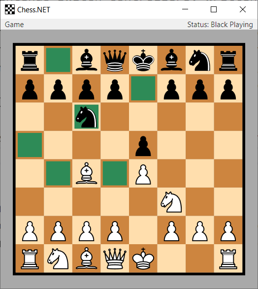
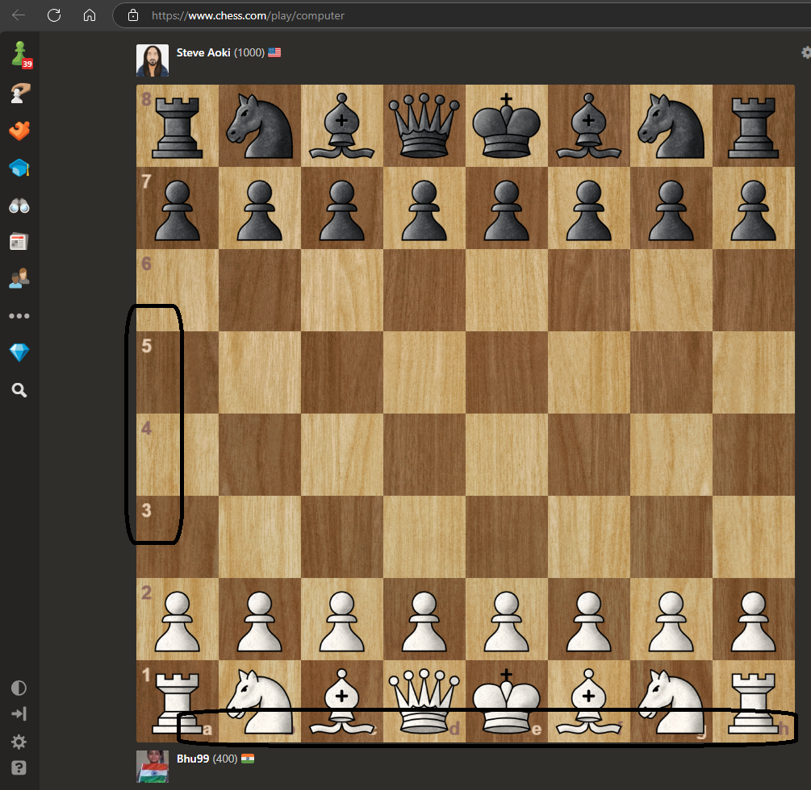

# Chess.NET

`Chess.NET` is a local two-player chess game, written in C#/WPF. It aims to provide a clean architecture and design according to the Model-View-ViewModel (MVVM) architectural pattern. Notable features are:

* Supports all standard rules of a chess game, including castling, en passant and promotion.
* Supports hints for chess piece movements, allowing only valid movements to be selected.
* Supports a wide range of animations using the features of WPF.
* Supports window resizing for arbitrary display resolutions.
* Provides a fully immutable implementation of the chess game model.
* Provides an undo command to restore previous chess game states.
* Provides a full code documentation.

ToDo

1. To add visual identifier to rows and columns.

2. For rows, its numbers 1 to 8, and for columns, its letters A to H.  
3. Need to add something similar to FieldVM to represent the row and column identifier of the chess board.
   1. Done, added RowColumnLableVM class.
4. Need to add a new property to the BoardVM class to hold the visual identifiers for the rows and columns.
   1. Done, added RowColumnLabels property to the BoardVM class.
5. And finally in the MainWindow.xaml, added new ItemsControl to display the row and column identifiers.
6. But the textblock text is not displaying properly, need to fix it.
   

